name: cemdi-may24
class: title, middle

## Crystal-GFN
### Sampling crystals with desirable properties and constraints

Presenting: Alex Hernández-García (he/il/él)

Mila AI4Science: Alex Hernandez-Garcia, Alexandre Duval, Alexandra Volokhova, Yoshua Bengio, Divya Sharma, Pierre Luc Carrier, Yasmine Benabed, Michał Koziarski, Victor Schmidt, Pierre-Paul De Breuck

.turquoise[Computational Energy Materials Design Infrastructure ([CEMDI](https://cemdi.inrs.ca/fr/2024symposium/)), May 28th 2024]

.center[

&nbsp&nbsp&nbsp&nbsp

]

.smaller[.footer[
Slides: [alexhernandezgarcia.github.io/slides/{{ name }}](https://alexhernandezgarcia.github.io/slides/{{ name }})
]]

---

## Problem and goals

.center[.bigger[We aim to develop machine learning algorithms for the .highlight1[inverse design of crystalline solids].]]

--

#### Desiderata:

- Candidates should have the desired properties.
- Candidates should be reasonable (constraints).
- Candidates should be diverse.
- Efficient exploration of the vast materials space.

--

#### Applications:

- Catalyst design for sustainability
- Solid electrolytes with high ionic conductivity
- _Your application here_

---

## Crystal structure generation in the literature

Example: .highlight2[Crystal Diffusion Variational Autoencoder (CDVAE)]: a diffusion process that moves .highlight1[atomic coordinates] towards a lower energy state and updates atom types to satisfy bonding preferences between neighbors. The key idea is to learn the diffusion process from the data distribution of stable materials. .cite[(Xie et al., 2022)]

.center[]

.references[Xie et al. [Crystal diffusion variational autoencoder for periodic material generation](https://arxiv.org/abs/2110.06197). ICLR 2022] 

???

A: atom types
X: atom coordinates
L: perdiodic lattice: l1, l2, l3 (3x3)

---

count: false

## Crystal structure generation in the literature

Example: .highlight2[Physics Guided Crystal Generative Model (PGCGM)]: A GAN with the affine matrices of the symmetry operations and element properties as inputs, augmented with a distance loss between real and fake materials, and data augmentation on the atomic positions. .cite[(Zhao et al., 2023)]

.center[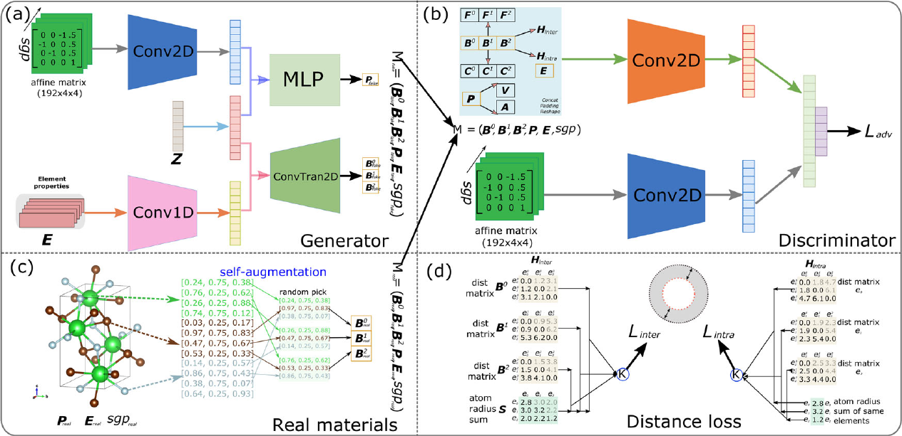]

.references[Zhao et al. [Physics guided deep learning for generative design of crystal materials with symmetry constraints](https://www.nature.com/articles/s41524-023-00987-9). npj computational materials 2023] 

---

count: false

## Crystal structure generation in the literature

Example: .highlight2[MatterGen]: An evolution of CDVAE that performs diffusion not only on atomic positions but also on the atom types and the lattice. .cite[(Zeni, Pinsler, Zügner, Fowler et al., 2023)]

.center[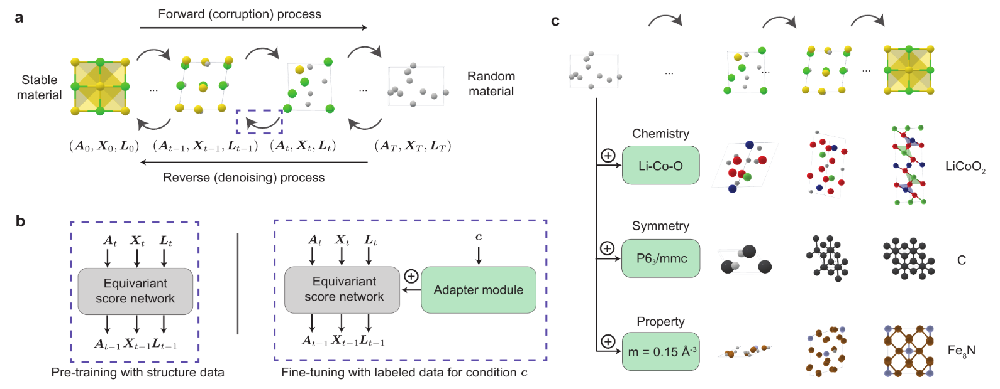]

.references[Zeni, Pinsler, Zügner, Fowler et al. [MatterGen: a generative model for inorganic materials design](https://arxiv.org/abs/2312.03687). arXiv 2023] 

---

count: false

## Crystal structure generation in the literature

Example: .highlight2[UniMat]: A denoising diffusion model learns to move atoms from random locations back to their original locations. Atoms not present in the crystal are moved to the null location during the denoising process, allowing crystals with an arbitrary number of atoms to be generated.

.center[]

.references[Yang et al. [Scalable Diffusion for Materials Generation](https://arxiv.org/abs/2311.09235). arXiv 2023] 

---

## A domain-inspired approach
### Crystal structure parameters

.context[CDVAE and other works tackle crystal structure generation in the space of atom coordinates.]

--

Instead of optimising the atom positions by learning from a small data set, we draw .highlight1[inspiration from theoretical crystallography to sample crystals in a lower-dimensional space of crystal structure parameters].

--

.highlight2[Space group]: symmetry operations of a repeating pattern in space that leave the pattern unchanged.

--

- There are 17 symmetry groups in 2 dimensions (wallpaper groups).
- There are 230 space groups in 3 dimensions.

---

count: false

## A domain-inspired approach
### Crystal structure parameters

.context[CDVAE and other works tackle crystal structure generation in the space of atom coordinates.]

Instead of optimising the atom positions by learning from a small data set, we draw .highlight1[inspiration from theoretical crystallography to sample crystals in a lower-dimensional space of crystal structure parameters].

.highlight2[Lattice system]: all 230 space groups can be classified into one of the 7 lattices.

.center[

  

  <figure>
      
    <figcaption><small>Triclinic</small></figcaption>
  </figure>
  

  

  <figure>
      
    <figcaption><small>Monoclinic</small></figcaption>
  </figure>
  

  

  <figure>
      
    <figcaption><small>Orthorhombic</small></figcaption>
  </figure>
  

  

  <figure>
      
    <figcaption><small>Tetragonal</small></figcaption>
  </figure>
  

  

  <figure>
      
    <figcaption><small>Rhombohedral</small></figcaption>
  </figure>
  

  

  <figure>
      
    <figcaption><small>Hexagonal</small></figcaption>
  </figure>
  

  

  <figure>
      
    <figcaption><small>Cubic</small></figcaption>
  </figure>
  

]

---

count: false

## A domain-inspired approach
### Crystal structure parameters

.context[CDVAE and other works tackle crystal structure generation in the space of atom coordinates.]

Instead of optimising the atom positions by learning from a small data set, we draw .highlight1[inspiration from theoretical crystallography to sample crystals in a lower-dimensional space of crystal structure parameters].

.highlight2[Lattice parameters]: The lattice's size and shape is characterised by 6 parameters: .highlight1[$a, b, c, \alpha, \beta, \gamma$].

.center[]

---

## GFlowNets as the generative framework
### A brief introduction

--

#### 3 key ingredients

--

 

1. .highlight1[Diversity] as an objective.

--
    - Given a score or reward function $R(x)$, learn to _sample objects $x$ proportionally to the reward_.
--
2. .highlight1[Compositionality] in the sample generation.

--
    - A meaningful decomposition of samples $x$ into multiple sub-states $s_0\rightarrow s_1 \rightarrow \dots \rightarrow x$ can yield generalisable patterns.
--
3. .highlight1[Deep learning] to learn from the generated samples.

--
    - A machine learning model can learn the transition function $F(s\rightarrow s')$ and generalise the patterns.

--

.references[
- Bengio et al. [Flow network based generative models for non-iterative diverse candidate generation](https://arxiv.org/abs/2106.04399), NeurIPS, 2021.
- Jain et al. [GFlowNets for AI-Driven Scientific Discovery](https://pubs.rsc.org/en/content/articlelanding/2023/dd/d3dd00002h). Digital Discovery, Royal Society of Chemistry, 2023.
]

---

## 1. Diversity as an objective

.context[Many existing approaches treat scientific discovery as an _optimisation_ problem.]

 
Given a reward or objective function $R(x)$, GFlowNet can be seen a generative model trained to sample objects $x \in \cal X$ according to .highlight1[a sampling policy $\pi(x)$ proportional to the reward $R(x)$]: 

--

.left-column[
$$\pi(x) = \frac{R(x)}{Z} \propto R(x)$$
]

--

.right-column[
$$Z = \sum_{x' \in \cal X} R(x')$$
]

--

.full-width[
&rarr; Sampling proportionally to the reward function enables finding .highlight1[multiple modes], hence .highlight1[diversity].

.center[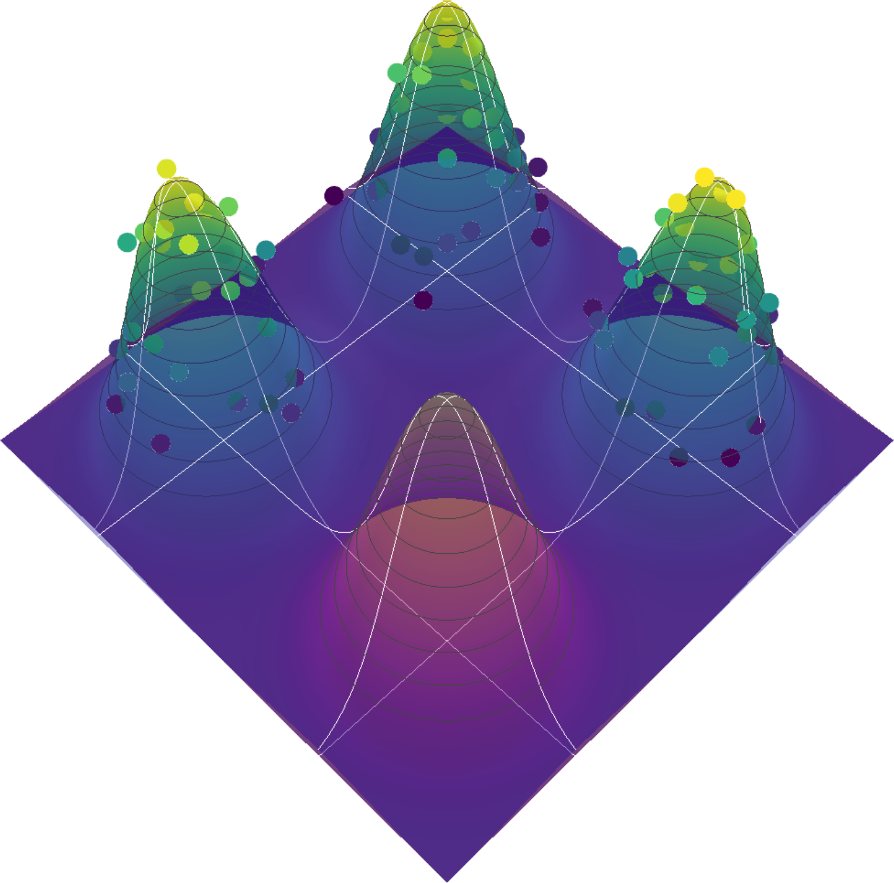]
]

---

## 2. Compositionality
### Sample generation process

.context35[Sampling _directly_ from a complex, high-dimensional distribution is difficult.]

The principle of compositionality is fundamental in semantics, linguistics, mathematical logic and is thought to be a cornerstone of human reasoning.

---

count: false

## 2. Compositionality
### Sample generation process

.context35[Sampling _directly_ from a complex, high-dimensional distribution is difficult.]

The principle of compositionality is fundamental in semantics, linguistics, mathematical logic and is thought to be a cornerstone of human reasoning.

.left-column-33[
.center[]
]

.right-column-66[
.center[]
]

---

count: false

## 2. Compositionality
### Sample generation process

.context35[Sampling _directly_ from a complex, high-dimensional distribution is difficult.]

For the Tetris problem, a meaningful decomposition of the samples is .highlight1[adding one piece to the board at a time].

--

.left-column[.center[]]

---

count: false

## 2. Compositionality
### Sample generation process

.context35[Sampling _directly_ from a complex, high-dimensional distribution is difficult.]

For the Tetris problem, a meaningful decomposition of the samples is .highlight1[adding one piece to the board at a time].

.left-column[.center[]]

---

count: false

## 2. Compositionality
### Sample generation process

.context35[Sampling _directly_ from a complex, high-dimensional distribution is difficult.]

For the Tetris problem, a meaningful decomposition of the samples is .highlight1[adding one piece to the board at a time].

.left-column[.center[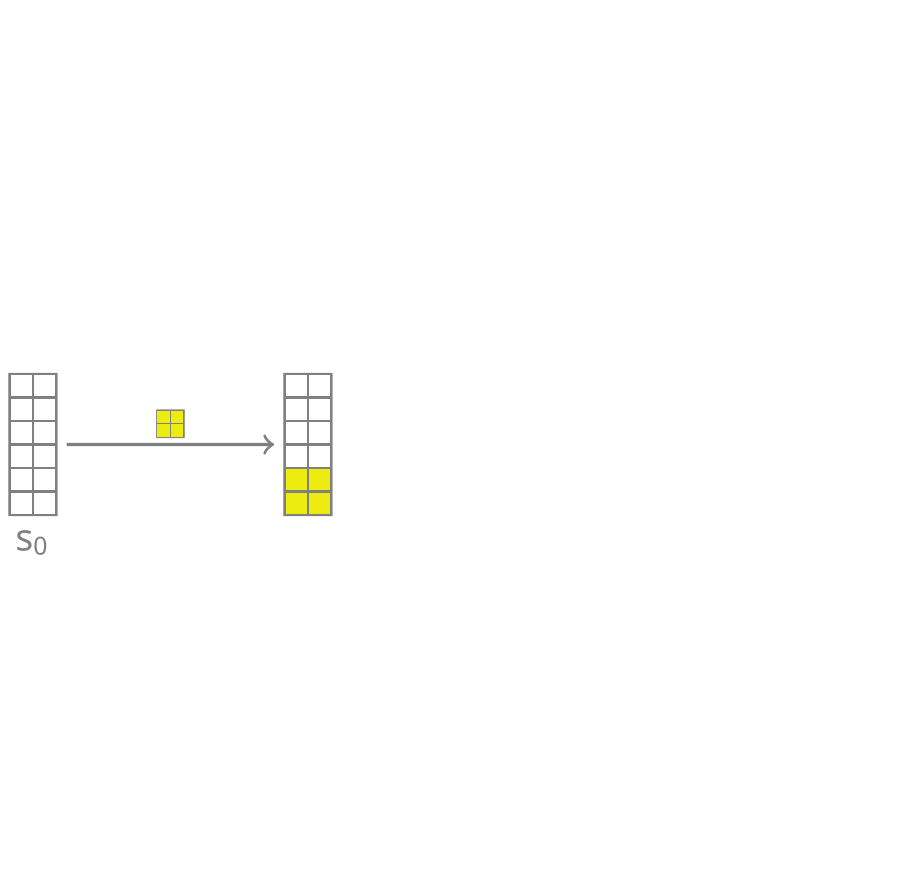]]

---

count: false

## 2. Compositionality
### Sample generation process

.context35[Sampling _directly_ from a complex, high-dimensional distribution is difficult.]

For the Tetris problem, a meaningful decomposition of the samples is .highlight1[adding one piece to the board at a time].

.left-column[.center[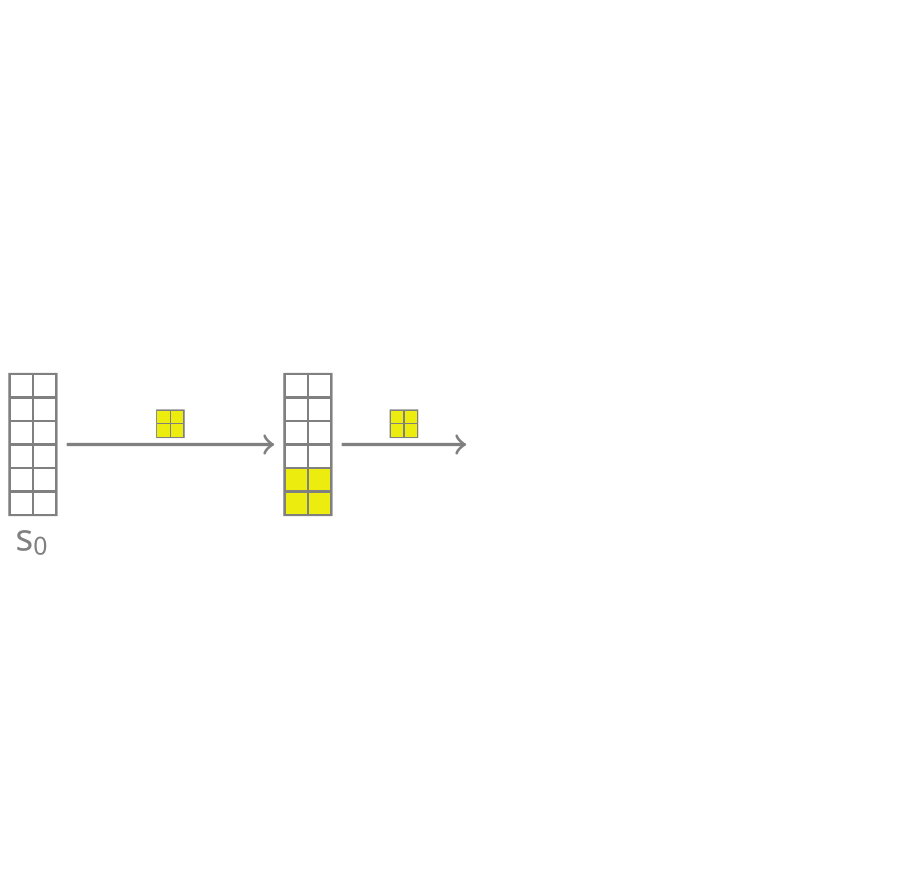]]

---

count: false

## 2. Compositionality
### Sample generation process

.context35[Sampling _directly_ from a complex, high-dimensional distribution is difficult.]

For the Tetris problem, a meaningful decomposition of the samples is .highlight1[adding one piece to the board at a time].

.left-column[.center[]]

---

count: false

## 2. Compositionality
### Sample generation process

.context35[Sampling _directly_ from a complex, high-dimensional distribution is difficult.]

For the Tetris problem, a meaningful decomposition of the samples is .highlight1[adding one piece to the board at a time].

.left-column[.center[]]

---

count: false

## 2. Compositionality
### Sample generation process

.context35[Sampling _directly_ from a complex, high-dimensional distribution is difficult.]

For the Tetris problem, a meaningful decomposition of the samples is .highlight1[adding one piece to the board at a time].

.left-column[.center[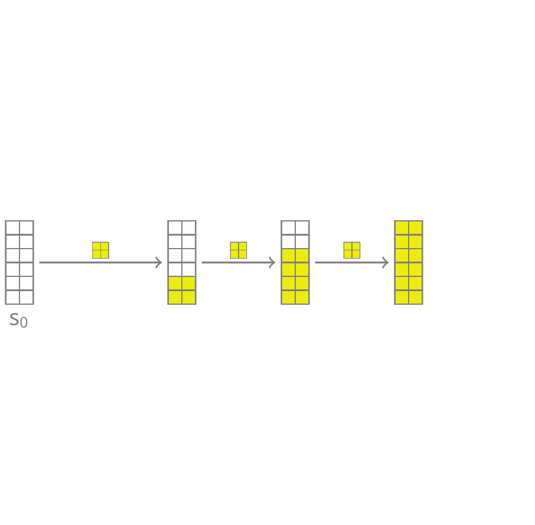]]

---

count: false

## 2. Compositionality
### Sample generation process

.context35[Sampling _directly_ from a complex, high-dimensional distribution is difficult.]

For the Tetris problem, a meaningful decomposition of the samples is .highlight1[adding one piece to the board at a time].

.left-column[.center[]]

---

count: false

## 2. Compositionality
### Sample generation process

.context35[Sampling _directly_ from a complex, high-dimensional distribution is difficult.]

For the Tetris problem, a meaningful decomposition of the samples is .highlight1[adding one piece to the board at a time].

.left-column[.center[]]

---

count: false

## 2. Compositionality
### Sample generation process

.context35[Sampling _directly_ from a complex, high-dimensional distribution is difficult.]

For the Tetris problem, a meaningful decomposition of the samples is .highlight1[adding one piece to the board at a time].

.left-column[.center[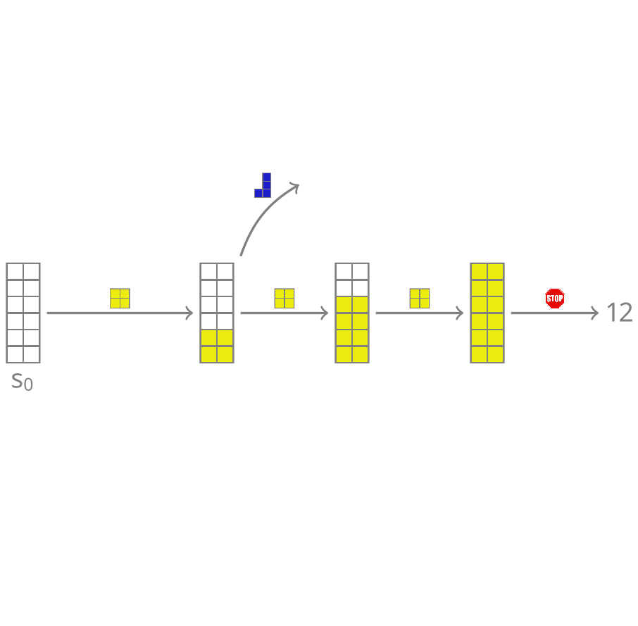]]

---

count: false

## 2. Compositionality
### Sample generation process

.context35[Sampling _directly_ from a complex, high-dimensional distribution is difficult.]

For the Tetris problem, a meaningful decomposition of the samples is .highlight1[adding one piece to the board at a time].

.left-column[.center[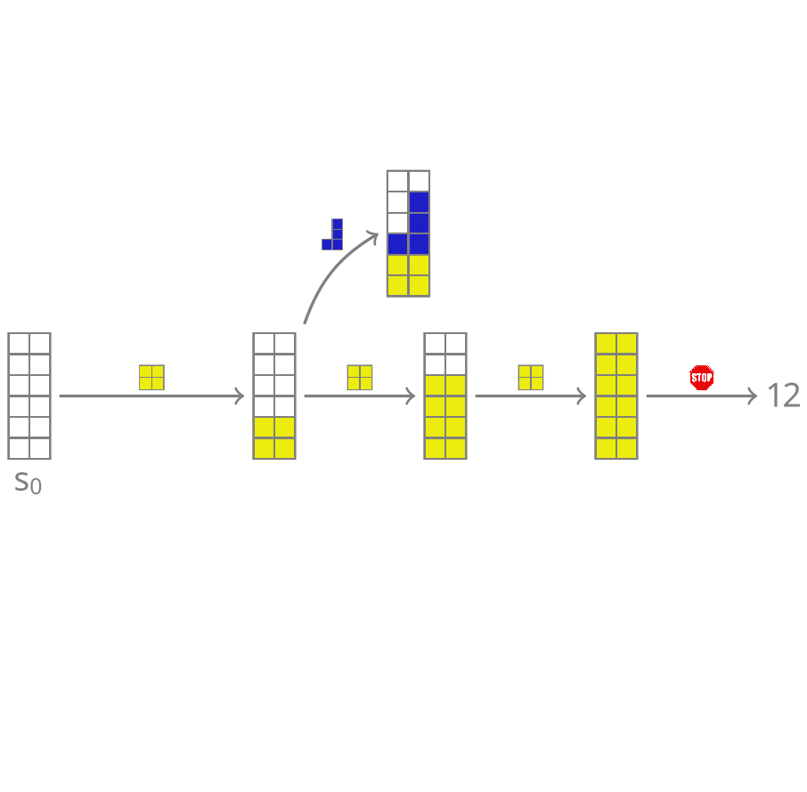]]

---

count: false

## 2. Compositionality
### Sample generation process

.context35[Sampling _directly_ from a complex, high-dimensional distribution is difficult.]

For the Tetris problem, a meaningful decomposition of the samples is .highlight1[adding one piece to the board at a time].

.left-column[.center[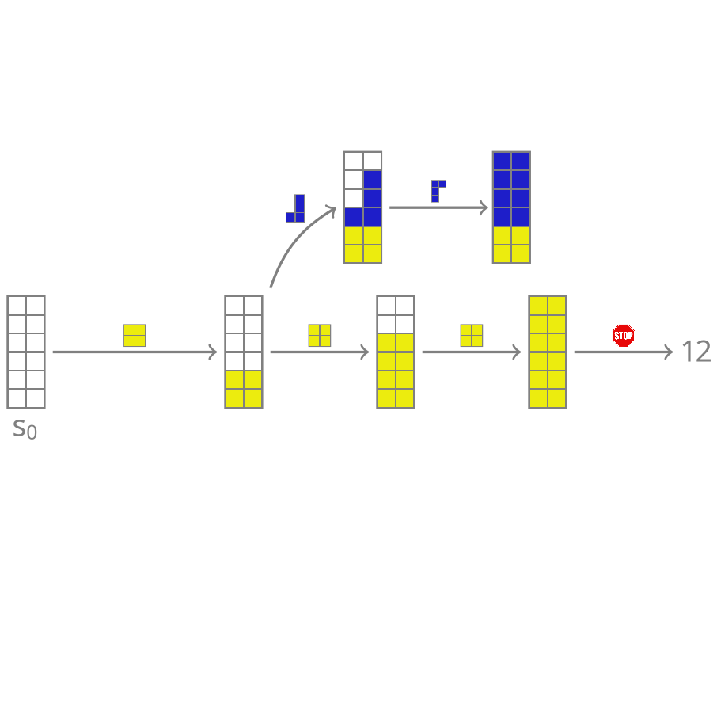]]

---

count: false

## 2. Compositionality
### Sample generation process

.context35[Sampling _directly_ from a complex, high-dimensional distribution is difficult.]

For the Tetris problem, a meaningful decomposition of the samples is .highlight1[adding one piece to the board at a time].

.left-column[.center[]]

---

count: false

## 2. Compositionality
### Sample generation process

.context35[Sampling _directly_ from a complex, high-dimensional distribution is difficult.]

For the Tetris problem, a meaningful decomposition of the samples is .highlight1[adding one piece to the board at a time].

.left-column[.center[]]

---

count: false

## 2. Compositionality
### Sample generation process

.context35[Sampling _directly_ from a complex, high-dimensional distribution is difficult.]

For the Tetris problem, a meaningful decomposition of the samples is .highlight1[adding one piece to the board at a time].

.left-column[.center[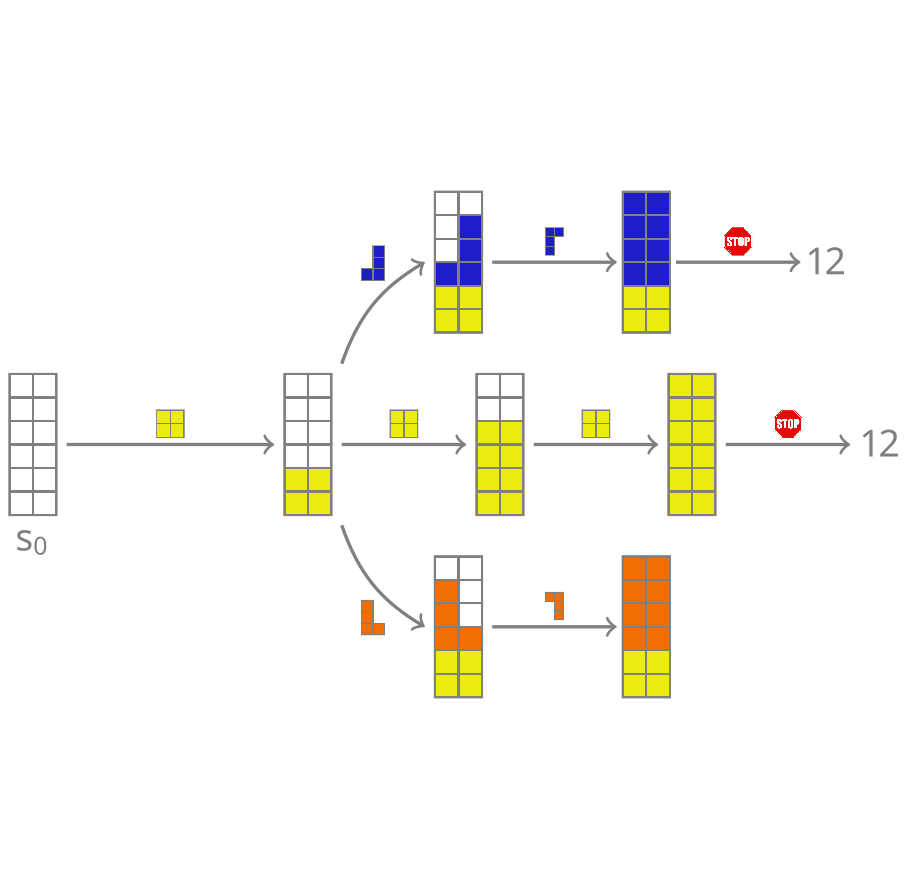]]

---

count: false

## 2. Compositionality
### Sample generation process

.context35[Sampling _directly_ from a complex, high-dimensional distribution is difficult.]

For the Tetris problem, a meaningful decomposition of the samples is .highlight1[adding one piece to the board at a time].

.left-column[.center[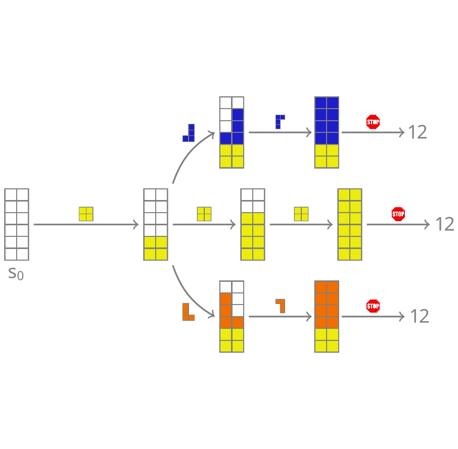]]

---

count: false

## 2. Compositionality
### Sample generation process

.context35[Sampling _directly_ from a complex, high-dimensional distribution is difficult.]

For the Tetris problem, a meaningful decomposition of the samples is .highlight1[adding one piece to the board at a time].

.left-column[.center[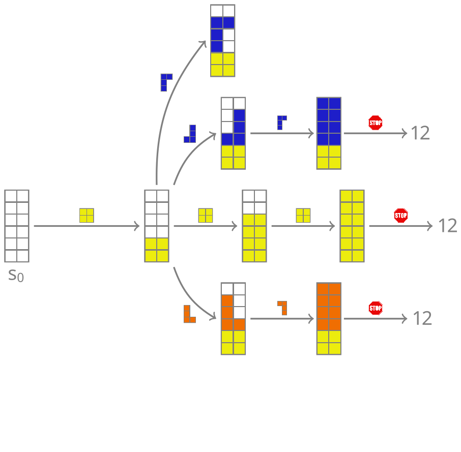]]

---

count: false

## 2. Compositionality
### Sample generation process

.context35[Sampling _directly_ from a complex, high-dimensional distribution is difficult.]

For the Tetris problem, a meaningful decomposition of the samples is .highlight1[adding one piece to the board at a time].

.left-column[.center[]]

---

count: false

## 2. Compositionality
### Sample generation process

.context35[Sampling _directly_ from a complex, high-dimensional distribution is difficult.]

For the Tetris problem, a meaningful decomposition of the samples is .highlight1[adding one piece to the board at a time].

.left-column[.center[]]

---

count: false

## 2. Compositionality
### Sample generation process

.context35[Sampling _directly_ from a complex, high-dimensional distribution is difficult.]

For the Tetris problem, a meaningful decomposition of the samples is .highlight1[adding one piece to the board at a time].

.left-column[.center[]]

---

count: false

## 2. Compositionality
### Sample generation process

.context35[Sampling _directly_ from a complex, high-dimensional distribution is difficult.]

For the Tetris problem, a meaningful decomposition of the samples is .highlight1[adding one piece to the board at a time].

.left-column[.center[]]

---

count: false

## 2. Compositionality
### Sample generation process

.context35[Sampling _directly_ from a complex, high-dimensional distribution is difficult.]

For the Tetris problem, a meaningful decomposition of the samples is .highlight1[adding one piece to the board at a time].

.left-column[.center[]]

---

count: false

## 2. Compositionality
### Sample generation process

.context35[Sampling _directly_ from a complex, high-dimensional distribution is difficult.]

For the Tetris problem, a meaningful decomposition of the samples is .highlight1[adding one piece to the board at a time].

.left-column[.center[]]

---

count: false

## 2. Compositionality
### Sample generation process

.context35[Sampling _directly_ from a complex, high-dimensional distribution is difficult.]

For the Tetris problem, a meaningful decomposition of the samples is .highlight1[adding one piece to the board at a time].

.left-column[.center[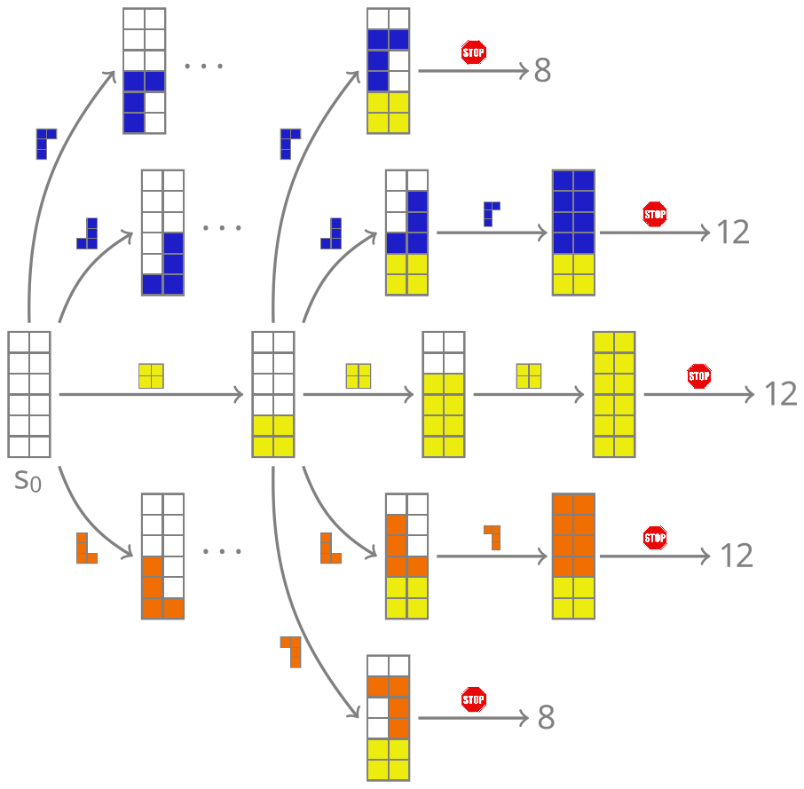]]

---

count: false

## 2. Compositionality
### Sample generation process

.context35[Sampling _directly_ from a complex, high-dimensional distribution is difficult.]

For the Tetris problem, a meaningful decomposition of the samples is .highlight1[adding one piece to the board at a time].

.left-column[.center[]]

---

count: false

## 2. Compositionality
### Sample generation process

.context35[Sampling _directly_ from a complex, high-dimensional distribution is difficult.]

For the Tetris problem, a meaningful decomposition of the samples is .highlight1[adding one piece to the board at a time].

.left-column[.center[]]

.right-column[
  
.conclusion[The decomposition of the sampling process into meaningful steps yields patterns that may be correlated with the reward function and facilitates learning complex distributions.]
]

---

count: false

## 2. Compositionality
### Sample generation process

.context35[Sampling _directly_ from a complex, high-dimensional distribution is difficult.]

For the Tetris problem, a meaningful decomposition of the samples is .highlight1[adding one piece to the board at a time].

.left-column[.center[]]

.right-column[
Objects $x \in \cal X$ are constructed through a sequence of actions from an .highlight1[action space $\cal A$].
]

.right-column[
At each step of the .highlight1[trajectory $\tau=(s_0\rightarrow s_1 \rightarrow \dots \rightarrow s_f)$], we get a partially constructed object $s$ in .highlight1[state space $\cal S$].
]

--

.right-column[
.conclusion[These ideas and terminology is reminiscent of reinforcement learning (RL).]
]

---

## 3. Deep learning policy

.context35[GFlowNets learn a sampling policy $\pi\_{\theta}(x)$ proportional to the reward $R(x)$.]

--

.left-column[
.center[]
]

---

count: false

## 3. Deep learning policy

.context35[GFlowNets learn a sampling policy $\pi\_{\theta}(x)$ proportional to the reward $R(x)$.]

.left-column[
.center[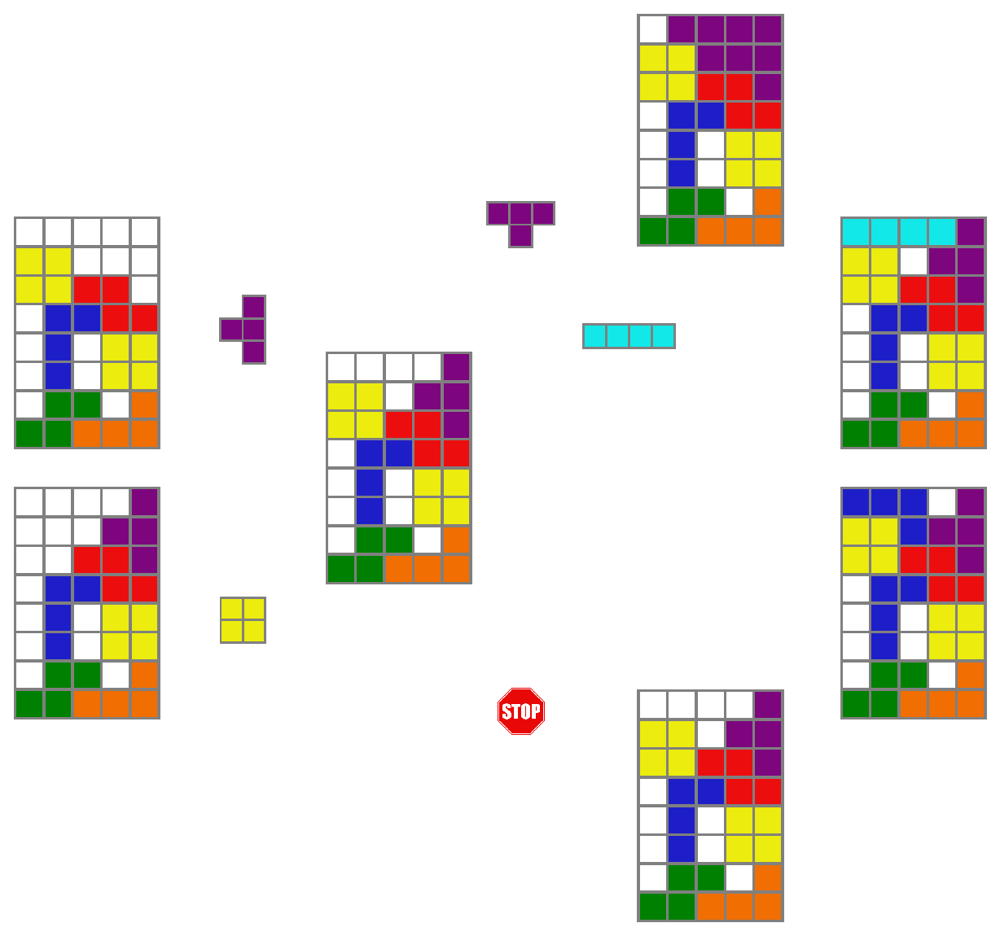]
]

.right-column[
 
Deep neural networks are trained to learn the transitions (flows) policy: $F\_{\theta}(s\_t\rightarrow s\_{t+1})$.
]

--

.right-column[
Consistent flow theorem (informal): if the sum of the flows into state $s$ is equal to the sum of the flows out, then $\pi(x) \propto R(x)$.
]

.references[
Bengio et al. [Flow network based generative models for non-iterative diverse candidate generation](https://arxiv.org/abs/2106.04399), NeurIPS, 2021. (_not_ co-authored)
]

--

.right-column[
.conclusion[GFlowNets can be trained with deep learning methods to learn a sampling policy $\pi\_{\theta}$ proportional to a reward $R(x)$.]
]

---

## Crystal-GFlowNet

.context[Compositional generation of crystals in the space of crystallographic properties.]

 
.center[]

---

count: false

## Crystal-GFlowNet

.context[Compositional generation of crystals in the space of crystallographic properties.]

 
.center[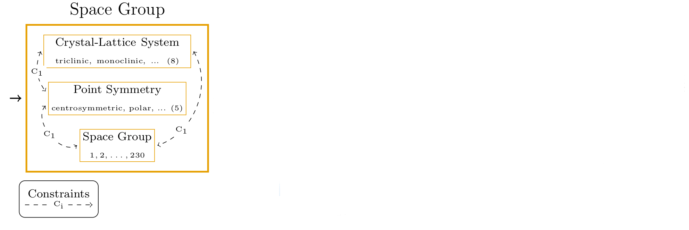]

---

count: false

## Crystal-GFlowNet

.context[Compositional generation of crystals in the space of crystallographic properties.]

 
.center[]

---

count: false

## Crystal-GFlowNet

.context[Compositional generation of crystals in the space of crystallographic properties.]

 
.center[]

---

count: false

## Crystal-GFlowNet

.context[Compositional generation of crystals in the space of crystallographic properties.]

 
.center[]

---

count: false

## Crystal-GFlowNet

.context[Compositional generation of crystals in the space of crystallographic properties.]

 
.center[]

---

count: false

## Crystal-GFlowNet

.context[Compositional generation of crystals in the space of crystallographic properties.]

 
.center[]

---

count: false

## Crystal-GFlowNet

.context[Compositional generation of crystals in the space of crystallographic properties.]

 
.center[]

---

count: false

## Crystal-GFlowNet

.context[Compositional generation of crystals in the space of crystallographic properties.]

 
.center[]

.conclusion[Crystal-GFN binds multiple spaces representing crystallographic and material properties, setting intra- and inter-space hard constraints in the generation process.]

---

## GFlowNet approach
### Advantages

.context[We generate materials in the lower-dimensional space of crystal structure parameters.]

* Constructing materials by their crystal structure parameters allows us to introduce .highlight1[physicochemical and geometric _hard_ constraints]:
--

    * Charge neutrality of the composition.
    * Compatibility of composition and space group.
    * Hierarchical structure of the space group.
    * Compatibility of lattice parameters and lattice system.
--
* .highlight1[Searching in the lower-dimensional space] of crystal structure parameters may be more efficient than in the space of atom coordinates.

--
* Provided we have access to a predictive model of a material property, we can .highlight1[flexibly generate materials with desirable properties].

--
* We can .highlight1[flexibly sample materials with specific characteristics, such as composition or space group]. 

---

## Crystal-GFlowNet
### Properties

We can train a Crystal-GFN with any reward function, provided it is computationally tractable. Therefore, we can use it to .highlight1[generate materials with different properties]. 
--
We have tested the following properties:

- .highlight1[Formation energy per atom] [eV/atom], via a pre-trained machine learning model.
- .highlight1[Electronic band gap] [eV] (squared distance to a target value, 1.34 eV), via a pre-trained machine learning model.
- .alpha50[Unit cell .highlight2[density] [g/cm3]: convenient as a proof of concept because we can calculate it _exactly_ from the GFN outputs.]

---

## Crystal-GFlowNet
### Proxy ML models of the formation energy and the band gap

- MLP architecture
- Inputs:
    - Space group embedding
    - Composition embedding as in PhAST (Duval et al., 2022)
    - Standardised lattice parameters
- Trained on MatBench (Materials Project)
    - Mean absolute error: 
        - Formation energy: 0.10 eV/atom $\pm$ 0.005
        - Band gap: 0.321 eV $\pm$ 0.003
- Reward: $R(x) = \exp(-\frac{MLP(x)}{T})$

---

## Crystal-GFlowNet
### Experiments

- Space groups: all 113 space groups present in the MatBench data set.
- Compositions:
    - Up to 5 unique elements from the these 22 elements: ts: H, Li, B, C, N, O, F, Na, Mg, Al, Si, P, S, Cl, K, V, Mn, Fe, Co, Ni, Cu, Se. Th (22 most common elements in the training set). 
    - Up to 16 atoms per element (80 atoms in total)
- Lattice parameters:
    - Lengths: 0.9-100 angstroms.
    - Angles: 50-150°.
    - These ranges contain the bulk of the data set (excluding outliers).

---

## Results
### Formation energy

.context35[The formation energy is predicted by a pre-trained ML model.]

.center[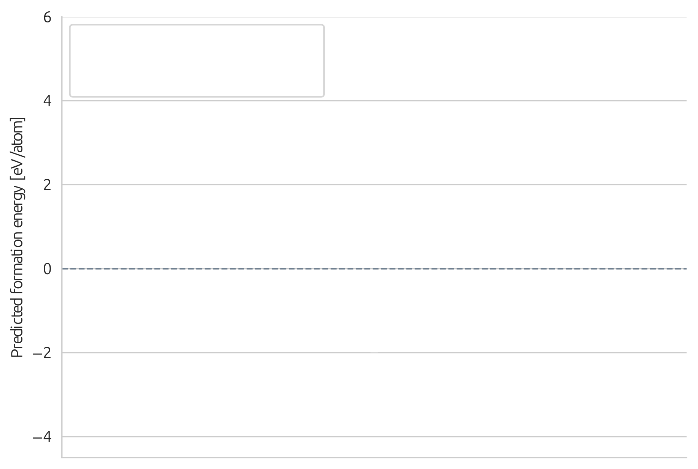]

---

count: false

## Results
### Formation energy

.context35[The formation energy is predicted by a pre-trained ML model.]

.center[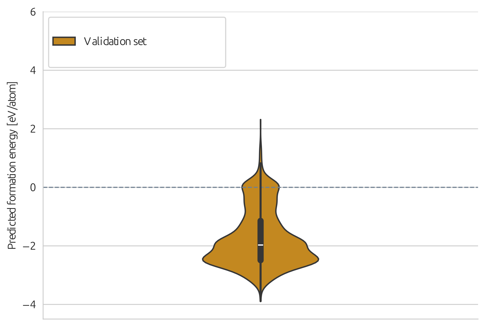]

---

count: false

## Results
### Formation energy

.context35[The formation energy is predicted by a pre-trained ML model.]

.center[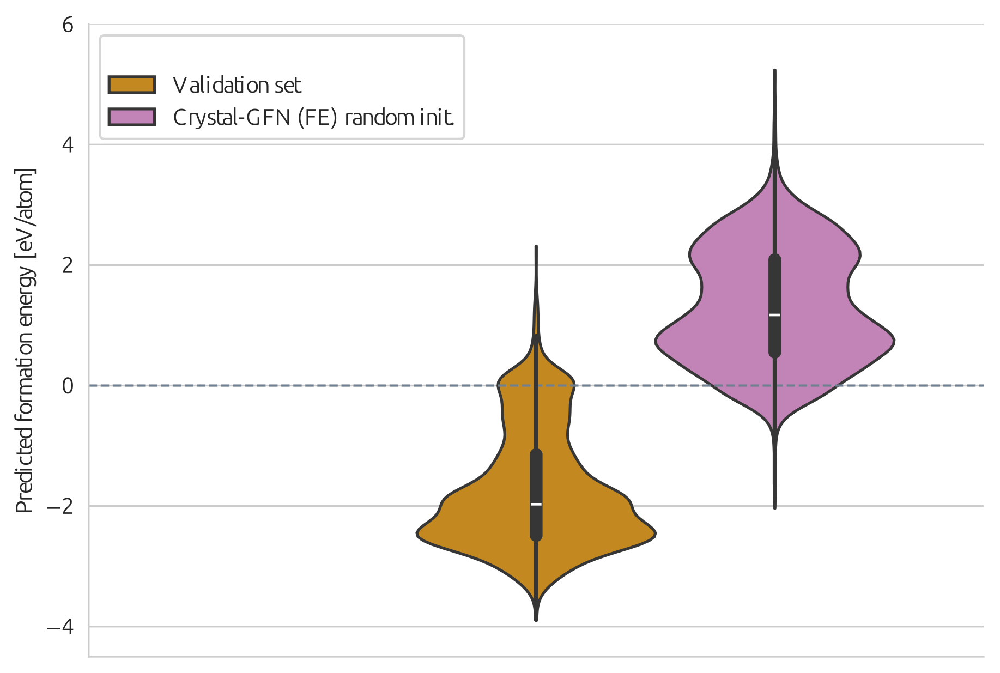]

---

count: false

## Results
### Formation energy

.context35[The formation energy is predicted by a pre-trained ML model.]

.center[]

---

count: false

## Results
### Formation energy

.context[.highlight1[After training, Crystal-GFN samples structures with even lower formation energy [eV/atom] than the validation set.]]

.center[]

---

## Results
### Band gap

.context35[We aimed at sampling structures with band gap close to 1.34 eV.]

.center[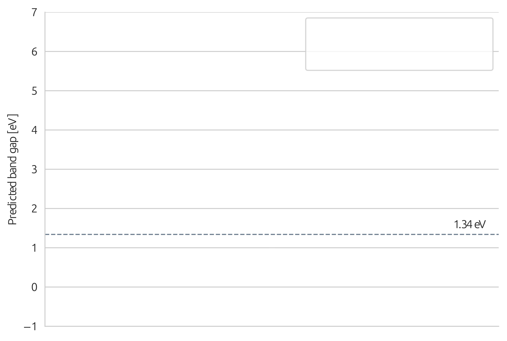]

---

count: false

## Results
### Band gap

.context35[We aimed at sampling structures with band gap close to 1.34 eV.]

.center[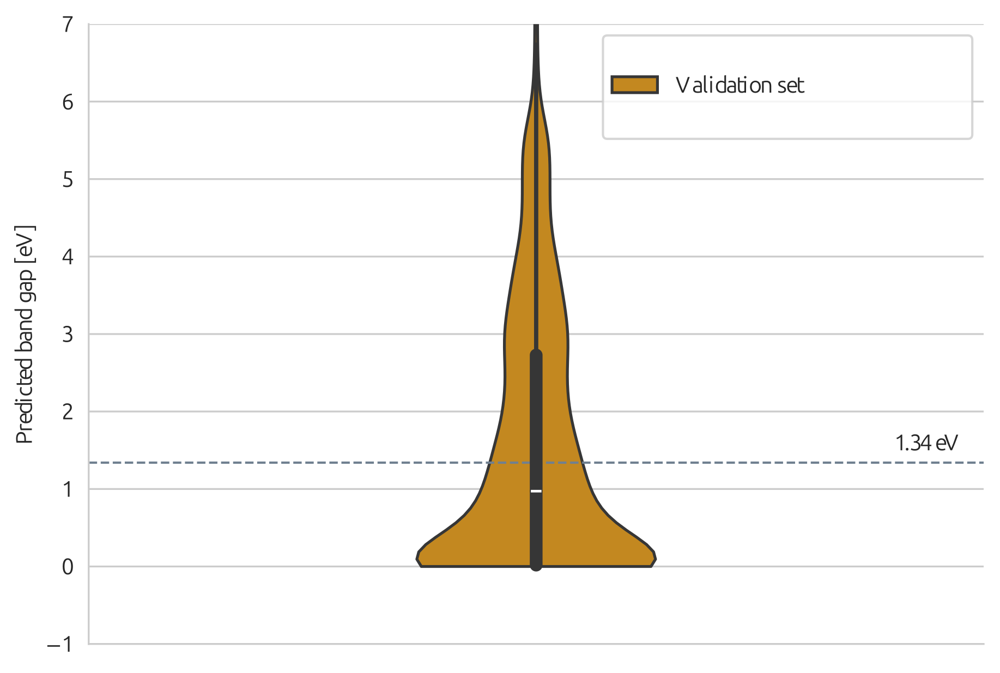]

---

count: false

## Results
### Band gap

.context35[We aimed at sampling structures with band gap close to 1.34 eV.]

.center[]

---

count: false

## Results
### Band gap

.context35[We aimed at sampling structures with band gap close to 1.34 eV.]

.center[]

---

count: false

## Results
### Band gap

.context[.highlight1[After training, Crystal-GFN samples structures with band gap [eV] around the target value.]]

.center[]

---

## Results
### Restricted sampling

We restrict the sampling space at sampling time:

- A: The composition is restricted to only elements Fe and O, with a maximum of 10 atoms per element.
- B: We sample in the ternary space for Li-Mn-O, keeping the element count to maximum 16 atoms.
- C: We restrict the space groups to only cubic lattices.
- D: We restrict the range of the lattice parameters to lengths between 10 and 20 angstroms and angles between 75 and 135 degrees.

---

## Results
### Restricted sampling

.center[]

---

## Results
### Diversity

.context[.highlight2[Diversity] is key in materials discovery.]

Analysis of 10,000 sampled crystals and the top-100 with lowest formation energy.

--

- All 10,000 samples are unique.

--
- All crystal systems, lattice systems and point symmetries found in the 10,000 samples.
    - 4 out of 8 crystal-lattice systems in the top-100.
    - 4 out of the 5 point symmetries in the top-100.
--
- All 22 elements found in the 10,000 samples.
    - 15 out of 22 elements in the top-100.
--
- 73 out of 113 space groups (65 %) found in the 10,000 samples
    - 19 out of 113 space groups in the top-100.

--

.conclusion[Crystal-GFN samples are highly diverse.]

---

name: title
class: title, middle

## Summary and conclusions

.center[]

---

## Summary and conclusions

* Instead of generating crystal structures in the space of atomic positions, we proposed to sample in a lower-dimensional space of crystallographic properties (space group, composition and lattice parameters).
* This representation allowed us to introduce .highlight1[physicochemical and structural _hard_ constraints], reducing the search space and improving validity.
    * Crystal-GFN was trained in 30 hours in a CPU-only machine.
* Our results show that we can generate .highlight1[diverse, high scoring samples with the desired constraints].
* We can flexibly select the desired material characteristics.
* The .highlight1[framework can be flexibly extended] with more constraints, crystal structure descriptors (atomic positions) and other properties. 

.references[
* Mila AI4Science et al. [Crystal-GFN: sampling crystals with desirable properties and constraints](https://arxiv.org/abs/2310.04925). AI4Mat, NeurIPS 2023 (spotlight).
]

.highlight2[Open source code]: [github.com/alexhernandezgarcia/gflownet](https://github.com/alexhernandezgarcia/gflownet)

---

## Acknowledgements
### Amazing co-authors and friends

.left-column[
* Alexandre Duval
* Alexandra Volokhova
* Pierre Luc Carrier
* Divya Sharma
* Victor Schmidt
* Pierre Paul de Breuck
* Yasmine Benabed
* Michał Koziarski
* Yoshua Bengio
]

---

name: cemdi-may24
class: title, middle

Mila AI4Science: Alex Hernandez-Garcia, Alexandre Duval, Alexandra Volokhova, Yoshua Bengio, Divya Sharma, Pierre Luc Carrier, Yasmine Benabed, Michał Koziarski, Victor Schmidt, Pierre-Paul De Breuck

[github.com/alexhernandezgarcia/gflownet](https://github.com/alexhernandezgarcia/gflownet)

.center[

&nbsp&nbsp&nbsp&nbsp

]

.footer[[alexhernandezgarcia.github.io](https://alexhernandezgarcia.github.io/) | [alex.hernandez-garcia@mila.quebec](mailto:alex.hernandez-garcia@mila.quebec)] 
.footer[[@alexhg@scholar.social](https://scholar.social/@alexhg)  | [@alexhdezgcia](https://twitter.com/alexhdezgcia) ]

.smaller[.footer[
Slides: [alexhernandezgarcia.github.io/slides/{{ name }}](https://alexhernandezgarcia.github.io/slides/{{ name }})
]]

