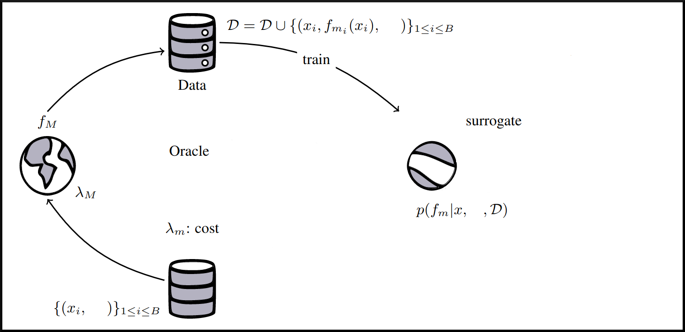
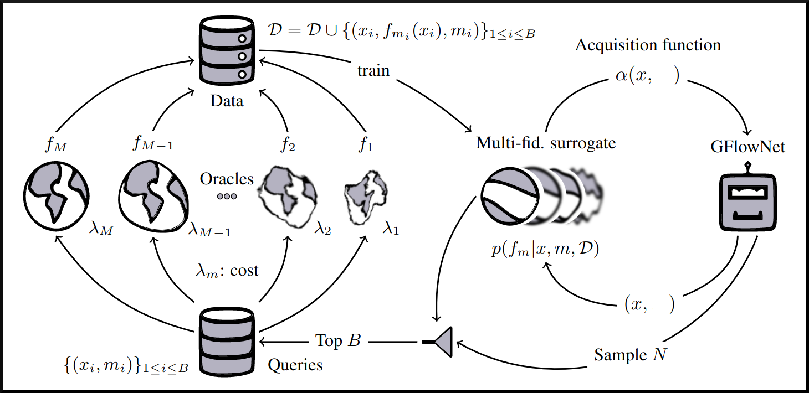
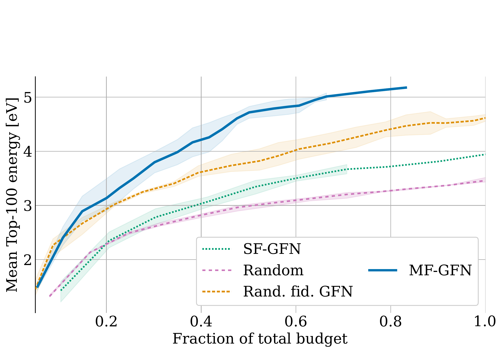
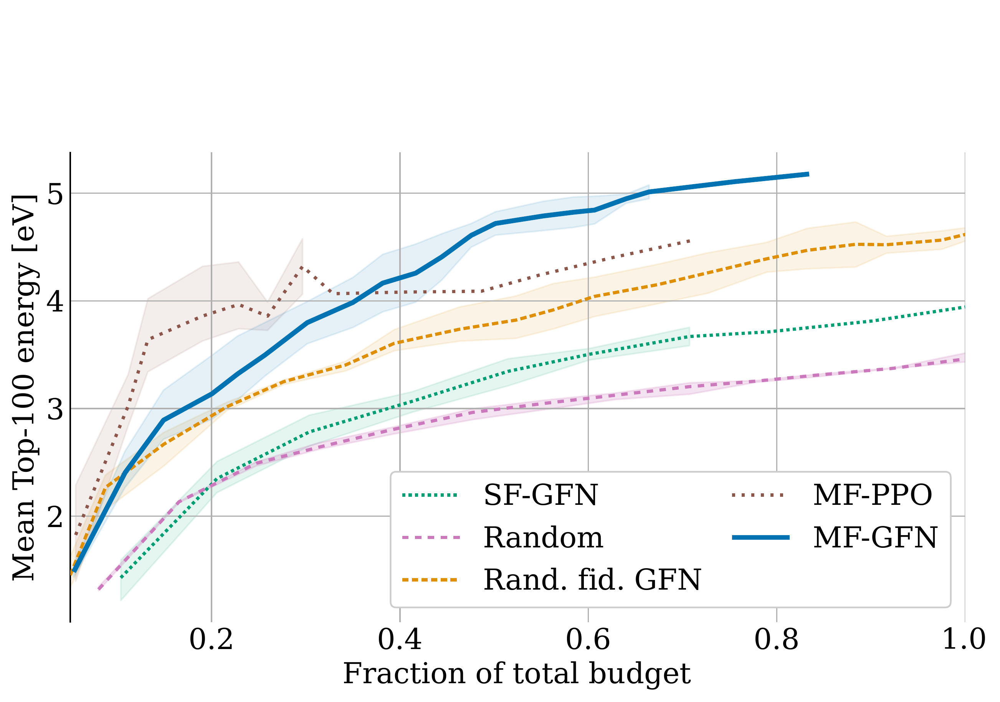
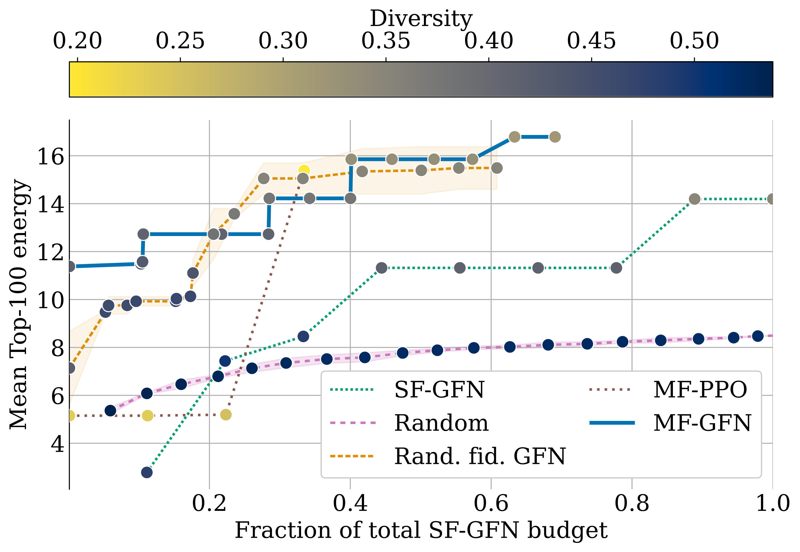
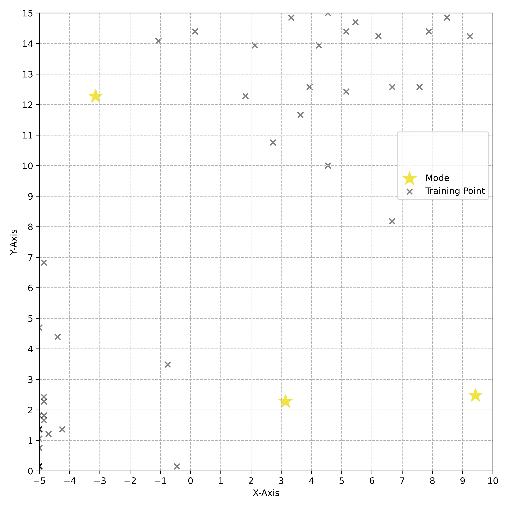
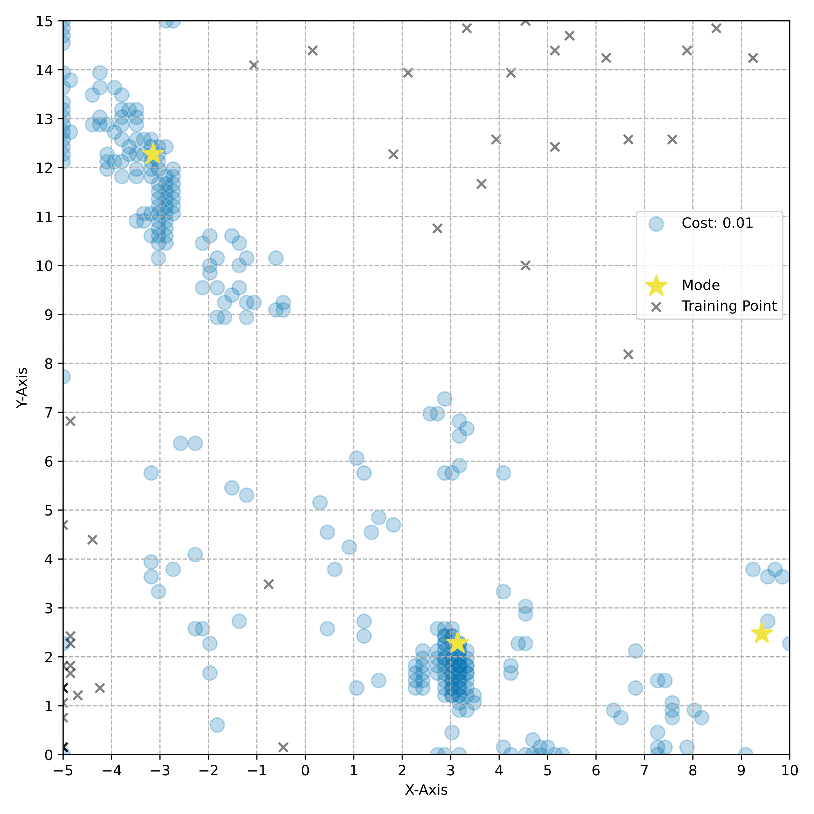
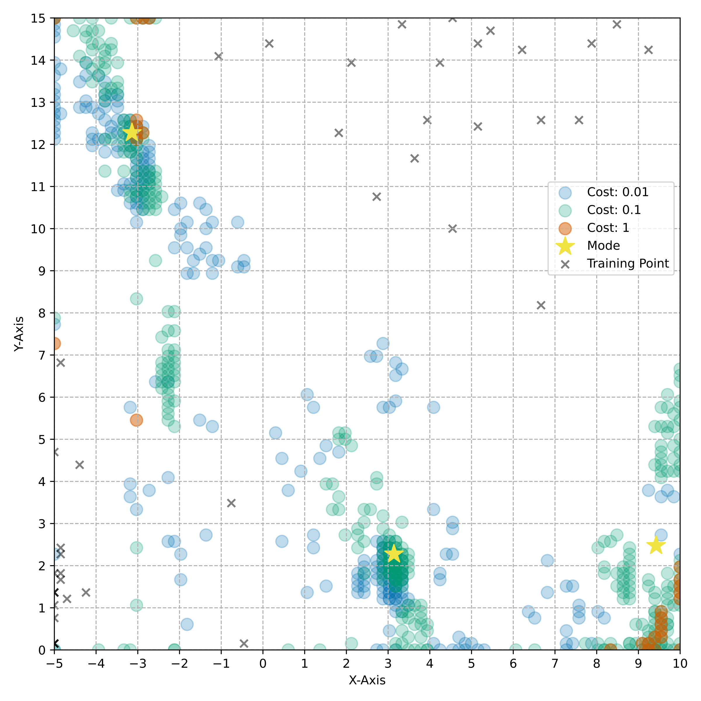

name: mfgfn-may24
class: title, middle

##  Multi-fidelity active learning with GFlowNets

Presenting: Alex Hernández-García (he/il/él)

Work with: Nikita Saxena, Moksh Jain, Chenghao Liu and Yoshua Bengio

.center[

&nbsp&nbsp&nbsp&nbsp

]

.smaller[.footer[
Slides: [alexhernandezgarcia.github.io/slides/{{ name }}](https://alexhernandezgarcia.github.io/slides/{{ name }})
]]

---

## Contribution

- An .highlight1[active learning] algorithm to leverage the availability of .highlight1[multiple oracles at different fidelities and costs].

--
- The goal is two-fold:
    1. Find high-scoring candidates
    2. Candidates must be diverse
--
- Experimental evaluation with .highlight1[biological sequences and molecules]:
    - DNA
    - Antimicrobial peptides
    - Small molecules
    - Classical multi-fidelity toy functions (Branin and Hartmann)

--

.conclusion[Likely the first multi-fidelity active learning method for biological sequences and molecules.]

---

## Our multi-fidelity active learning algorithm

.center[]

---

count: false

## Our multi-fidelity active learning algorithm

.center[]

---

count: false

## Our multi-fidelity active learning algorithm

.center[]

---

count: false

## Our multi-fidelity active learning algorithm

.center[]

---

count: false

## Our multi-fidelity active learning algorithm

.center[]

---

count: false

## Our multi-fidelity active learning algorithm

.center[]

---

count: false

## Our multi-fidelity active learning algorithm

.center[]

---

count: false

## Our multi-fidelity active learning algorithm

.center[]

---

count: false

## Our multi-fidelity active learning algorithm

.center[]

---

count: false

## Our multi-fidelity active learning algorithm

.center[]

---

count: false

## Our multi-fidelity active learning algorithm

.center[]

---

count: false

## Our multi-fidelity active learning algorithm

.center[]

---

count: false

## Our multi-fidelity active learning algorithm

.center[]

---

count: false

## Our multi-fidelity active learning algorithm

.center[]

---

## Experiments
### Baselines

.context[To our knowledge, .highlight1[the first multi-fidelity active learning algorithm tested on biological sequence design and molecular design problems]. There did not exist baselines from the literature.]

--

 
* .highlight1[SF-GFN]: GFlowNet with highest fidelity oracle to establish a benchmark for performance without considering the cost-accuracy trade-offs.

--
* .highlight1[Random]: Quasi-random approach where the candidates and fidelities are picked randomly and the top $(x, m)$ pairs scored by the acquisition function are queried.

--
* .highlight1[Random fid. GFN]: GFlowNet with random fidelities, to investigate the benefit of deciding the fidelity with GFlowNets.

--
* .highlight1[MF-PPO]: Replacement of MF-GFN with a reinforcement learning algorithm to _optimise_ the acquisition function.

---

## Small molecules

- Realistic experiments with experimental oracles and costs that reflect the computational demands (1, 3, 7).
- GFlowNet adds one SELFIES token (out of 26) at a time with variable length up to 64 ($|\mathcal{X}| > 26^{64}$). 
- Property: Adiabatic electron affinity (EA). Relevant in organic semiconductors, photoredox catalysis and organometallic synthesis.

--

.center[]

---

count: false

## Small molecules

- Realistic experiments with experimental oracles and costs that reflect the computational demands (1, 3, 7).
- GFlowNet adds one SELFIES token (out of 26) at a time with variable length up to 64 ($|\mathcal{X}| > 26^{64}$). 
- Property: Adiabatic electron affinity (EA). Relevant in organic semiconductors, photoredox catalysis and organometallic synthesis.

.center[]

---

count: false

## Small molecules

- Realistic experiments with experimental oracles and costs that reflect the computational demands (1, 3, 7).
- GFlowNet adds one SELFIES token (out of 26) at a time with variable length up to 64 ($|\mathcal{X}| > 26^{64}$). 
- Property: Adiabatic electron affinity (EA). Relevant in organic semiconductors, photoredox catalysis and organometallic synthesis.

.center[]

---

count: false

## Small molecules

- Realistic experiments with experimental oracles and costs that reflect the computational demands (1, 3, 7).
- GFlowNet adds one SELFIES token (out of 26) at a time with variable length up to 64 ($|\mathcal{X}| > 26^{64}$). 
- Property: Adiabatic electron affinity (EA). Relevant in organic semiconductors, photoredox catalysis and organometallic synthesis.

.center[]

---

count: false

## Small molecules

- Realistic experiments with experimental oracles and costs that reflect the computational demands (1, 3, 7).
- GFlowNet adds one SELFIES token (out of 26) at a time with variable length up to 64 ($|\mathcal{X}| > 26^{64}$). 
- Property: Adiabatic electron affinity (EA). Relevant in organic semiconductors, photoredox catalysis and organometallic synthesis.

.center[]

---

count: false

## Small molecules

- Realistic experiments with experimental oracles and costs that reflect the computational demands (1, 3, 7).
- GFlowNet adds one SELFIES token (out of 26) at a time with variable length up to 64 ($|\mathcal{X}| > 26^{64}$). 
- Property: Adiabatic electron affinity (EA). Relevant in organic semiconductors, photoredox catalysis and organometallic synthesis.

.center[]

---

count: false

## Small molecules

- Realistic experiments with experimental oracles and costs that reflect the computational demands (1, 3, 7).
- GFlowNet adds one SELFIES token (out of 26) at a time with variable length up to 64 ($|\mathcal{X}| > 26^{64}$). 
- Property: Adiabatic electron affinity (EA). Relevant in organic semiconductors, photoredox catalysis and organometallic synthesis.

.center[]

---

count: false

## Small molecules

- Realistic experiments with experimental oracles and costs that reflect the computational demands (1, 3, 7).
- GFlowNet adds one SELFIES token (out of 26) at a time with variable length up to 64 ($|\mathcal{X}| > 26^{64}$). 
- Property: Adiabatic .highlight1[ionisation potential (IP)]. Relevant in organic semiconductors, photoredox catalysis and organometallic synthesis.

.center[]

---

## DNA aptamers

- GFlowNet adds one nucleobase (`A`, `T`, `C`, `G`) at a time up to length 30. This yields a design space of size $|\mathcal{X}| = 4^{30}$. 
- The objective function is the free energy estimated by a bioinformatics tool. 
- The (simulated) lower fidelity oracle is a transformer trained with 1 million sequences.

--

.center[]

---

count: false

## Antimicrobial peptides (AMP)

- Protein sequences (20 amino acids) with variable length (max. 50).
- The oracles are 3 ML models trained with different subsets of data.

--

.center[]

---

## How does multi-fidelity help?

.context[Visualisation on the synthetic 2D Branin function task.]

.center[]

---

count: false

## How does multi-fidelity help?

.context[Visualisation on the synthetic 2D Branin function task.]

.center[]

---

count: false

## How does multi-fidelity help?

.context[Visualisation on the synthetic 2D Branin function task.]

.center[]

---

count: false

## How does multi-fidelity help?

.context[Visualisation on the synthetic 2D Branin function task.]

.center[]

---

## Multi-fidelity active learning with GFlowNets
### Summary and conclusions

.references[
* Hernandez-Garcia, Saxena et al. [Multi-fidelity active learning with GFlowNets](https://arxiv.org/abs/2306.11715). RealML, NeurIPS 2023.
]

* Current ML for science methods do not utilise all the information and resources at our disposal.

--
* AI-driven scientific discovery demands learning methods that can .highlight1[efficiently discover diverse candidates in combinatorially large, high-dimensional search spaces].

--
* .highlight1[Multi-fidelity active learning with GFlowNets] enables .highlight1[cost-effective exploration] of large, high-dimensional and structured spaces, and discovers multiple, diverse modes of black-box score functions.

--
* This is to our knowledge the first algorithm capable of effectively leveraging multi-fidelity oracles to discover diverse biological sequences and molecules.

---

count: false

name: title
class: title, middle

## Overall summary and conclusions

.center[]

---

## Summary and conclusions

- Tackling the climate crisis _is_ tackling health challenges.

--
- Machine learning has great potential to accelerate scientific discoveries. There are strong synergies between materials discovery and drug discovery methods.

--
- With GFlowNets, we are able to address some important challenges: discover diverse candidates in very large, complex search spaces.

--
- Crystal-GFN rethinks crystal structure generation by introducing domain knowledge and hard constraints to discover materials with desirable properties.

--
- Multi-fidelity active learning with GFlowNets effectively leverages the availability of multiple oracles for the first time for certain scientific discovery problems.

---

name: mlforscience-mar24
class: title, middle

Alex Hernández-García (he/il/él)

.center[

&nbsp&nbsp&nbsp&nbsp

]

.footer[[alexhernandezgarcia.github.io](https://alexhernandezgarcia.github.io/) | [alex.hernandez-garcia@mila.quebec](mailto:alex.hernandez-garcia@mila.quebec)] 
.footer[[@alexhg@scholar.social](https://scholar.social/@alexhg)  | [@alexhdezgcia](https://twitter.com/alexhdezgcia) ]

.smaller[.footer[
Slides: [alexhernandezgarcia.github.io/slides/{{ name }}](https://alexhernandezgarcia.github.io/slides/{{ name }})
]]
