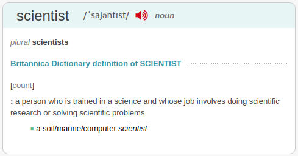

name: science-as-critical-thinking
class: title, middle

## Science as Critical Thinking
#### A (so far) messy slide deck about the role of scientists in the world and how science is value-laden and political

Alex Hernández-García (he/il/él)

.center[

&nbsp&nbsp&nbsp&nbsp

]

.smaller[.footer[
Slides: [alexhernandezgarcia.github.io/slides/{{ name }}](https://alexhernandezgarcia.github.io/slides/{{ name }})
]]

---

name: title
class: title, middle

## What is a scientist?

.center[]

---

## What is a scientist?

.left-column[
.center[]
.center[]
]

.right-column[
.center[]
.center[]
]

---

## What is _my ideal_ scientist?

--

    
.center[]

---

## The scientist and the world

--

The following statements are versions of commonly heard ideas about science and scientists:

--

> "Objectivity is one the principles underlying the scientific approach."

--

> "A scientist shall detach from their personal values and passions so that they do not interfere with their subject of study."

--

> "Is value free or autonomous science methodologically possible? If so, to what extent?"

--

> "Value-laden or ideologically informed science is always bad science."

--

.smaller[
Examples:

* ["politics shouldn't be in science"](https://x.com/mahmoudnafifi/status/1803246935362408941)
* ["politics should be left outside across the board"](https://x.com/sitzikbs/status/1803252019572146449)
]

---

## The scientist and the world
### Insights from (a critical perspective of) Philosophy of Science

.references[
Helen Longino, _Science as Social Knowledge_. 1990.
]

--

- To what extent do or should scientific theories shape moral and social values?
- To what extent do social and moral values shape scientific theories?

--

   
.center[]

---

## The scientist and the world
### Insights from (a critical perspective of) Philosophy of Science

.references[
Helen Longino, _Science as Social Knowledge_. 1990.
]

--

> "I will argue not only that scientific practices and content on the one hand and social needs and values on the other are in dynamic interaction but that the logical and cognitive structures of scientific inquiry require such interactions"

--

> "The knowledge and culture of a class society reflect the interests of its ruling class."

--

> "Societies in which one race or sex (or one race-sex combination) is dominant generally distribute their resources disproportionally."

--

> "Hypotheses become knowledge when they are subjected to scrutiny from diverse perspectives, especially by those with diverse beliefs and values."

---

name: title
class: title, middle

## So, what can I do?

.center[]

---

## So, what can I do?
### Watch

.center[
<figure>
	
  <figcaption>.smaller[Picture a Scientist (2020)]</figcaption>
</figure>
]

---

## So, what can I do?
### Read

.columns-4[.center[
<figure>
	
  <figcaption>.smaller[[Science as Social Knowledge, Helen Longino (1990)](https://www.jstor.org/stable/j.ctvx5wbfz)]</figcaption>
</figure>
]]
.columns-4[.center[
<figure>
	
  <figcaption>.smaller[[Atlas of AI, Kate Crawford (2021)](https://en.wikipedia.org/wiki/Atlas_of_AI)]</figcaption>
</figure>
]]
.columns-4[.center[
<figure>
	
  <figcaption>.smaller[[Race After Technology, Ruha Benjamin (2019)](https://en.wikipedia.org/wiki/Race_After_Technology)]</figcaption>
</figure>
]]
.columns-4[.center[
<figure>
	
  <figcaption>.smaller[[Braiding Sweetgrass, Robin Wall Kimmerer (2013)](https://en.wikipedia.org/wiki/Braiding_Sweetgrass)]</figcaption>
</figure>
]]

---

## So, what can I do?
### Read

.columns-4[.center[
<figure>
  
  <figcaption>.smaller[[The Death of Nature: Women, ecology, and the scientific revolution, Carolyn Merchant (1980)](https://en.wikipedia.org/wiki/The_Death_of_Nature)]</figcaption>
</figure>
]]
.columns-4[.center[
<figure>
  
  <figcaption>.smaller[[The Dialectical Biologist, Richard Levins and Richard Lewontin, (1985)](https://en.wikipedia.org/wiki/The_Dialectical_Biologist)]</figcaption>
</figure>
]]
.columns-4[.center[
<figure>
  
  <figcaption>.smaller[[Biology as Ideology, Richard Lewontin (1990)](https://magazine.scienceforthepeople.org/lewontin-special-issue/biology-as-ideology-review/)]</figcaption>
</figure>
]]
.columns-4[.center[
<figure>
  
  <figcaption>.smaller[[Can neuroscience change our minds?, Hilary Rose and Steven Rose (2016)](https://archive.org/details/canneurosciencec0000rose/page/n1/mode/2up)]</figcaption>
</figure>
]]

---

## So, what can I do?
### Read

* [The myth of apolitical science](https://www.science.org/doi/10.1126/science.aav4900), Science
* [Special Collection: In Memoriam: Richard Lewontin (1929–2021)](https://magazine.scienceforthepeople.org/lewontin-special-collection/), Science for the People Magazine
    * [Richard Lewontin, Dialectical Materialism, the Relationship Between Evolutionary Biology and Marxism](https://magazine.scienceforthepeople.org/lewontin-special-issue/richard-lewontin-dialectical-materialism-the-relationship-between-evolutionary-biology-and-marxism/), Erik I. Svensson
    * [Biology as Ideology at 30](https://magazine.scienceforthepeople.org/lewontin-special-issue/biology-as-ideology-review/), review of Biology as Ideology by Kulyash Zhumadilova
* [The Folly of Apolitical Science](https://bioethicstoday.org/blog/the-folly-of-apolitical-science/), Johnathan Flowers
* [Yes, Science Is Political](https://www.scientificamerican.com/article/yes-science-is-political/), Scientific American

---

## So, what can I do?
### Listen

* [‘Stick to the science’: when science gets political](https://www.nature.com/articles/d41586-020-03067-w). A three-part podcast series explores the intimate relationship between politics and science. Nature.
* [The physicist who tried to debunk postmodernism](https://www.youtube.com/watch?v=ESEFUaEA7kk), Dr. Fatima, on YouTube.

---

## So, what can I do?
### Act

.center[
<figure>
	
  <figcaption>.smaller[[Science for the People](http://www.scienceforthepeople.ca/)]</figcaption>
</figure>
]
.center[
<figure>
	
  <figcaption>.smaller[[Scientist Rebellion](https://scientistrebellion.org/)]</figcaption>
</figure>
]

---

## So, what can I do?
### Act (and read)

.columns-5[.center[
<figure>
	
  <figcaption>.smaller[[Cooperation](https://magazine.scienceforthepeople.org/volume-24-number-3-cooperation/)]</figcaption>
</figure>
]]
.columns-5[.center[
<figure>
	
  <figcaption>.smaller[[Bleeding Earth](https://magazine.scienceforthepeople.org/volume-25-number-2-bleeding-earth/)]</figcaption>
</figure>
]]
.columns-5[.center[
<figure>
	
  <figcaption>.smaller[[Science under occupation](https://magazine.scienceforthepeople.org/vol23-1/)]</figcaption>
</figure>
]]
.columns-5[.center[
<figure>
	
  <figcaption>.smaller[[The Science we need](https://magazine.scienceforthepeople.org/vol22-2/)]</figcaption>
</figure>
]]
.columns-5[.center[
<figure>
	
  <figcaption>.smaller[[Ways of knowing](https://magazine.scienceforthepeople.org/ways-of-knowing/)]</figcaption>
</figure>
]]

.references[
[magazine.scienceforthepeople.org](https://magazine.scienceforthepeople.org/)
]

---

name: title
class: title, middle

> "El buen investigador o investigadora es, sobre todo, una buena persona" .cite[Fernando Maestre]

Alex Hernández-García (he/il/él)

.center[

&nbsp&nbsp&nbsp&nbsp

]

.footer[[alexhernandezgarcia.github.io](https://alexhernandezgarcia.github.io/) | [alex.hernandez-garcia@mila.quebec](mailto:alex.hernandez-garcia@mila.quebec)] 
.footer[[@alexhg@scholar.social](https://scholar.social/@alexhg)  | [@alexhdezgcia](https://twitter.com/alexhdezgcia) ]

.smaller[.footer[
Slides: [alexhernandezgarcia.github.io/slides/yb-retreat-oct23](https://alexhernandezgarcia.github.io/slides/yb-retreat-oct23)
]]

